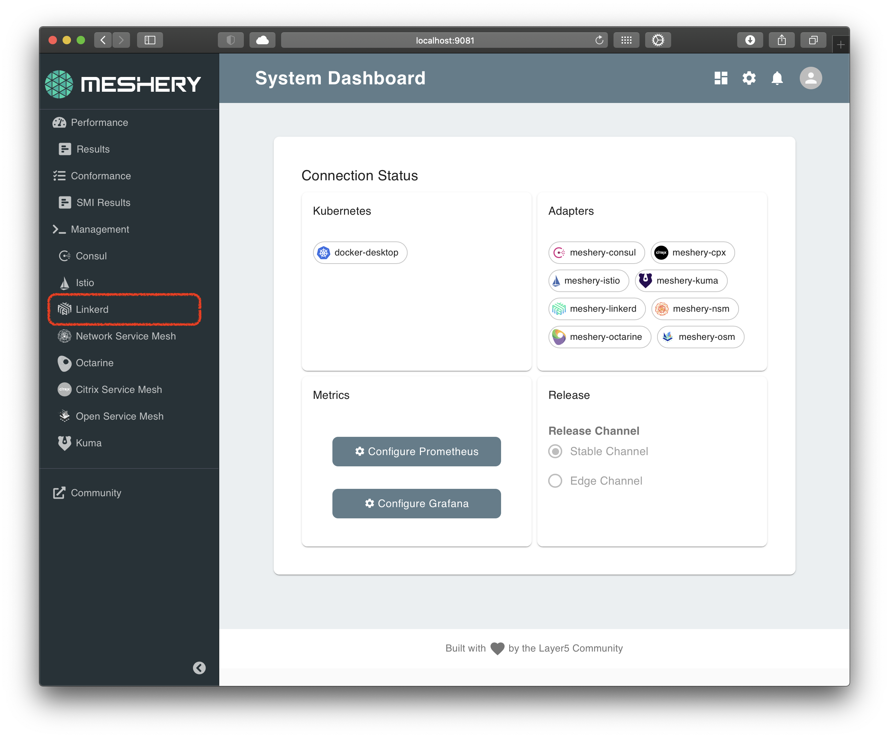
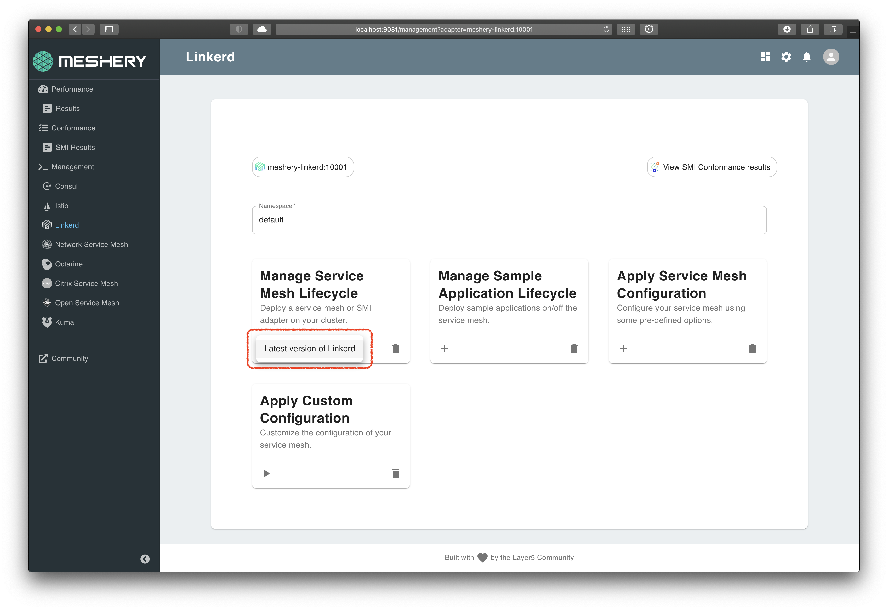

# Lab 1 - Deploy Linkerd

With [prerequisites](../prereq/README.md) complete, you are ready to download and deploy Linkerd resources.

## Steps

- [1. Install Linkerd](#1)
- [2. Verify install](#2)
- [3. Confirm add-ons](#3)

## <a name="1"></a> 1 - Install Linkerd

Using Meshery, select Linkerd from the `Management` menu.

<a href="img/linkerd-adapter.png">

</a>

In the Linkerd management page:

1. Type `linkerd` into the namespace field.
1. Click the (+) icon on the `Install` card and select `Latest Linkerd` to install the latest version of Linkerd.

   <a href="img/install-linkerd.png">
   
   </a>

<small>For manual steps go [here](#appendix)</small>

## <a name="2"></a> 2 - Verify install

Linkerd is deployed in the `linkerd` Kubernetes namespace. Verify that Linkerd and its components are deployed, execute the command:

```sh
linkerd check
```

## <a name="3"></a> 3 - Enforce mTLS strict mode

By establishing mutually-authenticated connections between Linkerd proxies , Linkerd automatically enables mutual Transport Layer Security (mTLS) by default for most HTTP-based communication between services.

## <a name="4"></a> 4 - Confirming Add-ons

Linkerd, as part of this workshop, is installed with several optional addons like:

1. [Prometheus](https://prometheus.io/)
2. [Grafana](https://grafana.com/)
3. [Jaeger](https://www.jaegertracing.io/)
4. [Dashboard](https://linkerd.io/2/reference/architecture/#dashboard)

You will use Prometheus and Grafana for collecting and viewing metrics, and c[Jaeger](https://www.jaegertracing.io/) for viewing distribued traces.


## [Continue to Lab 2](../lab-2/README.md): Deploy Sample Emojivoto app

<br />
<hr />

Alternative, manual installation steps are provided for reference below. No need to execute these if you have performed the steps above.

<hr />

## <a name="appendix"></a> Appendix - Alternative Manual Install

### <a name="1.1"></a> 1.1 - Download Linkerd

You will download and deploy the latest Linkerd resources on your Kubernetes cluster.

**_Note to Docker Desktop users:_** please ensure your Docker VM has atleast 4GiB of Memory, which is required for all services to run.

### <a name="1.2"></a> 1.2 - Setting up `linkerd` CLI

On a \*nix system, you can setup `linkerd` by doing the following:

The above command will get the latest Linkerd package and untar it in the same folder.

Change into the Linkerd package directory and add the `linkerd` client to your PATH environment variable.

```sh
curl -sL https://run.linkerd.io/install | sh
export PATH=$PATH:$HOME/.linkerd2/bin
```

Alternatively, on MacOS you can sue `HomeBrew` to install `linkerd`

```sh
brew install linkerd
```

To verify `linkerd` is setup lets try to print out the command help

```sh
linkerd version
```

We can use a new feature in linkerd to check if the cluster is ready for install:

```sh
linkerd check --pre
```

### Install Linkerd:

Deploy Linkerd custom resources:

```sh
linkerd install | kubectl apply -f -
```

Use the following command to see the progress on the installation of Linkerd custom CRDs and components

```sh
linkerd check
```
