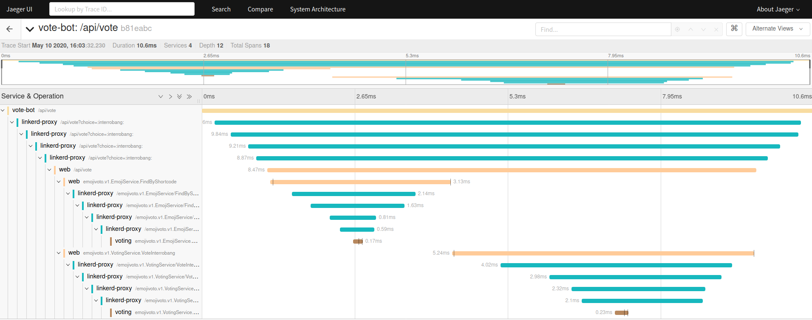
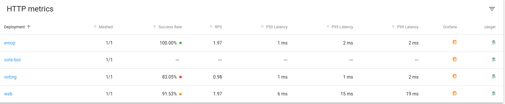

# Lab 6 - Linkerd Telemetry & Distributed Tracing

## 6.1 - Linkerd Telemetry

Linkerd's telemetry and monitoring features function automatically, without requiring any work on the part of the developer.

We have already looked at Linkerd Telemetry, not by name but by concept. Using stat, top and tap is one of the major and characterstic feature which Linkerd offers out of the box. All of this metrics are also accessible through Grafana Dashboard which Linkerd provides.

Accessing Grafana Dashboard for each service in Linkerd :

- Start `linkerd dashboard` & navigate over the service you would want to see Grafana Dashboard for.
- In the last column, click of the `Grafana Icon` to access the metrics dashboard for the following deployment.

## 6.2 Distributed tracing with Linkerd

Linkerd added support for Distributed Tracing, which means that if your application has enabled tracing based on B3 Propagation, Linkerd proxies would automatically recognize that (as the trace-id is propogated through http headers) and send their spans, provided that the proxies are configured regarding the meshed trace collector endpoint.

A service mesh would not be able to give you traces automatically though its in the request-response path, as it can’t map a inbount request to the corresponding outbound requests. So, It is needed for the application to be instrumented. In languages like Golang, where there is ctx.Context primitive used widely already, Instrumentation is very easy as the changes required here are to update the application server to generate the trace-id header and then make sure to pass the ctx.Context everywhere and use it when sending outbound requests. This is required as the Trace collector, needs a way to map inbound to outbound requests. This is done by using the metadata passed through the context.

To enable tracing onto your cluster :

```sh
cat >> config.yaml << EOF
tracing:
  enabled: true
EOF
```

This configuration file can also be used to apply Add-On configuration (not just specific to tracing Add-On).

Let us apply that configuration to the linkerd upgrade command using the --addon-config flag and pipe that output to kubectl apply.

```sh
linkerd upgrade --addon-config config.yaml | kubectl apply -f -
```

Before moving onto the next step, make sure everything is up and running with kubectl:

```sh
kubectl -n linkerd rollout status deploy/linkerd-collector
kubectl -n linkerd rollout status deploy/linkerd-jaeger
```

## 6.2.1 Configure your sample application

Apply the tracing configuration to the `emojivoto application`:

```sh
kubectl -n emojivoto patch -f https://run.linkerd.io/emojivoto.yml -p '
spec:
  template:
    metadata:
      annotations:
        config.linkerd.io/trace-collector: linkerd-collector.linkerd:55678
        config.alpha.linkerd.io/trace-collector-service-account: linkerd-collector
'
```

Before moving onto the next step, make sure everything is up and running with kubectl:

```sh
kubectl -n emojivoto rollout status deploy/web
```

The above command enables tracing in the linkerd proxies but the application containers still don’t have it enabled. Tracing can be enabled in the sample application can be enabled by

To enable tracing in emojivoto, run:

```sh
 kubectl -n emojivoto set env --all deploy OC_AGENT_HOST=linkerd-collector.linkerd:55678
```

## 6.3 Explore Jaeger

Now, you can port-forward the `linkerd-jaeger` service to checkout the traces.

```sh
kubectl -n linkerd port-forward svc/linkerd-jaeger 16686:16686
```

Now let's explore traces of the `vote-bot` endpoint :



So, As you can see there are spans of the linkerd-proxy. For each request between two meshed components, you can see there are four linkerd-proxy spans.

The first two spans would be the spans sent from the proxy of the client component and will be marked as outbound. Again, in these two spans, the first one is the span of the application -> proxy, and the second one is the proxy->otherside. They are differentiated by the server and client tags respectively.

## 6.4 Jaeger & Linkerd

In Linkerd, as told above Grafana Integration is present in the `linkerd-web` ui through which which you can directly jump onto the dashboards of any workload like deployment, pod, etc.

Linkerd has done similar thing with Jaeger, if you have `tracing` enabled, if you navigate to `linkerd-web` ui you should see jaeger icon in the extreme right.

**Cleanup the tracing components**

```sh
kubectl delete ns tracing emojivoto
```


## [Continue to Lab 7](../lab-7/README.md) - Traffic Splitting using SMI
